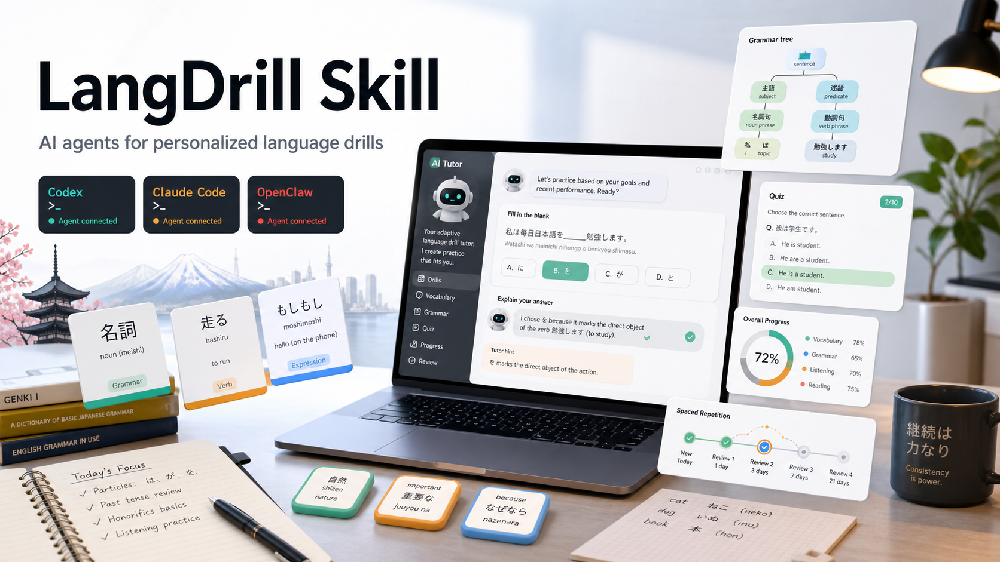

# LangDrill Skill



LangDrill Skill 是一个面向语言学习场景的通用 agent skill。它把 Codex、OpenClaw、Claude Code 等智能体变成可长期维护学习进度的语言学习助手：先理解你的目标语言、考试目标、学习背景和截止时间，再根据考纲、真题题型、每日输入和复习算法生成刷题训练。

它不是一次性的“出几道题”提示词，而是一套带本地数据库、考纲知识库、复习调度、错题回流和发布模板的语言学习工作流。

## 适合谁

- 想把 AI agent 变成私人语言学习教练的人。
- 需要围绕考试大纲刷词汇、语法、阅读、听力或综合题的人。
- 希望练习过程可恢复、可追踪、可复习，而不是散落在聊天记录里的人。
- 想基于本地资料和考纲扩展英语、日语或其他语言训练流程的人。

## 核心能力

- **学习建档**：首次启动时收集目标语言、考试目标、学习背景、截止时间、每日题量、偏好、当前掌握情况和提醒需求。
- **考纲导入**：支持把词汇、语法、题型、真题索引等结构化到 `data/kb/<exam-id>/`，并要求标注来源和年份。
- **动态选材**：根据当天新学、到期复习、复习中内容、已掌握内容和错题回流选择候选知识点。
- **Agent 成题**：脚本只挑选候选和维护状态，正式题面由 agent 按目标考试风格编写，避免僵硬模板题。
- **整套落库**：生成完整题单后先写入 SQLite，再逐题展示，保证跨会话可恢复。
- **即时判题**：每答一题都回写作答、题目状态、词汇/语法掌握度、错题记录和下次复习时间。
- **复习调度**：用本地数据库维护长期记忆状态，支持保守处理“已学但没有准确日期”的旧内容。
- **错题回流**：错题不会只停留在聊天里，而会进入后续候选池。
- **资料边界**：运行日志、维护记录、习题日记、当日总结和临时文件都有模板与忽略规则，便于公开发布。

## 当前状态

- 支持方向：日语、英语。
- 已内置日语资料：大学日语四级 2023 考纲、高中日语 2020 课程/词法资源。
- 英语资料：预留 `data/kb/english/`，需要在用户确认考试目标后导入对应考纲。
- 个人历史：已清空。模板数据库只保留可复用考纲与资料索引。
- 发布协议：MIT License，允许使用、复制、修改、分发、再授权和商业使用。

## 工作流

1. **初始化目标**
   - 运行 `init_today.py`
   - 补齐 `data/background/student_profile.md`
   - 确认目标语言、考试、日期、题量和偏好

2. **准备考纲**
   - 将原始资料放入 `data/kb/material-inbox/`
   - 把词汇、语法、题型等整理到 `data/kb/<exam-id>/`
   - 确认是否索引近年真题作为题型参考

3. **导入学习内容**
   - 导入当天新词、新语法或已有学习清单
   - 对无准确日期的旧内容使用保守复习策略

4. **生成完整题单**
   - 脚本选择候选
   - agent 编写符合考试风格的完整题单
   - 题单写入 `data/study.db`

5. **逐题训练**
   - 聊天中一次只展示一道题
   - 用户回答后立即判题、讲解、回写状态
   - 完成后进行会话级复习校准和数据审计

## Skill 入口

项目内 skill 源码：

```text
skills/lang-drill-coach/
```

同步到本机 Codex skills 目录：

```powershell
py .\scripts\publish_skill.py
```

默认同步位置：

```text
D:\2Folder\skills\lang-drill-coach
```

## 快速开始

运行初始化：

```powershell
py .\scripts\init_today.py
```

导入词汇：

```powershell
py .\scripts\import_vocab.py --text "term|reading_or_pronunciation|meaning|pos|notes"
```

导入语法：

```powershell
py .\scripts\import_grammar.py --text "pattern|meaning|usage|example|confusable_with"
```

选择候选并抽取题面背景：

```powershell
py .\scripts\select_session_content.py --target-minutes 35
py .\scripts\extract_background_candidates.py --target-minutes 35
```

持久化 agent 编写的题单：

```powershell
py .\scripts\persist_authored_session.py --input-json .\tmp\authored_session.json
```

查看当前会话和下一题：

```powershell
py .\scripts\session_status.py
```

判题并回写：

```powershell
py .\scripts\grade_answer.py --question-id 1 --user-answer A
```

## 目录说明

- `skills/lang-drill-coach/`：skill 源码和 agent 使用说明。
- `scripts/`：导入、选材、背景抽取、落库、判题、复习校准、审计和发布脚本。
- `data/study.db`：本地 SQLite 学习数据库。
- `data/background/student_profile.md`：学习者档案模板。
- `data/kb/`：考纲、词表、真题索引和资料源。
- `data/kb/cjt4/`：大学日语四级 2023 结构化资料。
- `data/kb/gaokao-japanese/`：高中日语 2020 结构化资料。
- `data/kb/english/`：英语考试资料预留入口。
- `doc/错题集.md`：错题模板，运行后可生成错题记录。
- `doc/习题日记/`：实际使用题目的每日回放模板。
- `doc/当日总结/`：每日总结模板。
- `logs/`：脚本运行日志模板，实际日志默认不提交。
- `tmp/`：临时草稿目录，实际临时文件默认不提交。
- `assets/cover.png`：发布封面图。

## 发布边界

公开发布版本会保留目录模板，但不发布个人维护记录和真实运行内容：

- 不发布 `doc/进展记录.md`
- 不发布真实日志
- 不发布真实临时文件
- 不发布个人学习/作答/错题/日记/总结内容

## 许可证

本项目采用 MIT License。

你可以自由使用、复制、修改、合并、发布、分发、再授权和商业使用本项目，但必须在副本或重要部分中保留版权声明和许可证声明。详见 `LICENSE`。
